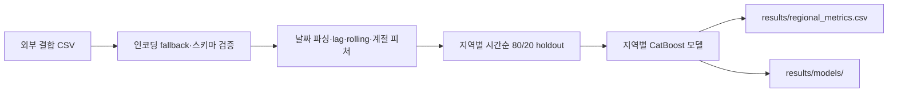

# 인천 e음 캐시백 정책 시뮬레이션

[English](README.md)

> [프로젝트 자세히 보기](PORTFOLIO.ko.md)

인천 e음카드의 지역별 소비를 예측하고 캐시백 정책을 검토하는 탐색적 워크플로입니다. 원본 노트북과 지역별 시간 순서 holdout을 위한 유지보수용 명령행 경로가 함께 들어 있습니다.

## 범위와 결과 해석

- 유지되는 코드는 결합 CSV를 읽고, 지역별 시계열 피처를 만든 뒤 CatBoost holdout 모델을 학습합니다.
- 원본 보고서는 2020~2023년 데이터, 5%·10% 조건별 LightGBM, 66개 캐시백 조합, Hurst 0.79~0.86, 다수 구간의 MAPE 10~15%를 기록합니다. 이는 관측 데이터에 기반한 정책 시뮬레이션이며, 캐시백의 인과 효과나 실제 ROI를 증명하지는 않습니다.
- CLI는 지역별 소비를 예측하지만, ROI 최적화나 정책 개입 효과 추정까지 수행하지 않습니다.

## 구현한 흐름



노트북에는 LPF, EDA, 정책·클러스터링·시각화 실험이 더 남아 있습니다. 명령행 경로는 모든 노트북을 그대로 재현하기보다, 휴대 가능한 기본선을 제공합니다.

## 보관된 시각 자료


*그림 1. 프로젝트에서 보관한 소비·예산·신규 가입 추이입니다. 표시된 24.92% 변화는 서술적 프로젝트 결과이며, 현재 CLI가 산출한 인과 추정치는 아닙니다.*


*그림 2. 탐색 단계의 피처 점검용 상관 히트맵입니다.*

## 실행

```powershell
pip install -r requirements.txt

python run_pipeline.py `
  --input-csv data\merged.csv `
  --region-col "<지역 컬럼>" `
  --date-col "<날짜 컬럼>" `
  --target-col "<소비 타깃 컬럼>"
```

명령은 생성 피처, 지역별 지표, 학습된 모델을 `results/`에 씁니다. 원본 데이터는 저장소에 포함하지 않습니다.

## 구조와 다음 단계

`run_pipeline.py`가 유지되는 진입점이며, `src/`에는 전처리·피처 엔지니어링·지역별 CatBoost 학습 코드가 있습니다. 재현성을 높이려면 허용된 데이터 스키마 또는 합성 fixture, 패키지 버전, 지역별 backtest와 naive baseline을 남겨야 합니다. 정책 검토에서는 예측과 인과 효과 추정을 분리해야 합니다.

## 문서

- [포트폴리오 사례 연구](PORTFOLIO.ko.md)
- [프로젝트 리뷰](docs/PROJECT_REVIEW.md)
