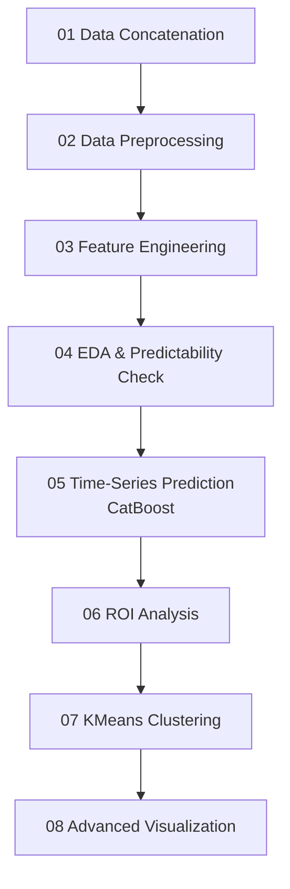

# 🏆 Incheon e-Eum Local Currency: Consumption Prediction & Policy Simulation

[](https://www.python.org/downloads/)
[](https://catboost.ai/)
[]()

## 🚀 Executive Summary (TL;DR)
- **The Problem**: Local currency (Incheon e-Eum) policies lack data-driven validation, leading to inefficient budget allocation across regions and business types.
- **The Solution**: Developed a comprehensive pipeline that clusters regions by policy sensitivity, predicts consumption using CatBoost with complex time-series features, and calculates ROI for optimal budget distribution.
- **The Result**: Discovered that ROI varies significantly by region (up to 3x difference), providing a framework for localized, high-efficiency policy design.

## 🛠 Tech Stack
- **Modeling**: CatBoostRegressor (Time-Series Forecasting)
- **Clustering**: KMeans (n_clusters=3) on Sensitivity Metrics
- **Data Processing**: Pandas, NumPy
- **Feature Engineering**: Rolling statistics (7, 30, 90 days), Lags (1, 3, 30 days)

---

## 🔬 1. Problem Definition
The Incheon e-Eum local currency system is a critical tool for boosting the local economy, but its policies have historically lacked data-driven validation. This led to inefficient budget allocation.
- **Background**: Local governments often apply flat cashback rates (e.g., 10%) across all regions and business types without considering varying consumer responses, risking budget depletion.
- **Objective**: To predict daily consumption spending, simulate policy impacts, and discover the optimal budget distribution strategy across different regions of Incheon.
- **Vision**: "Moving from 'One-Size-Fits-All' to 'Data-Driven Precision' in public policy."

---

## 🛠️ 2. System Architecture
To handle the end-to-end process from data cleaning to policy simulation, we developed a structured 8-stage pipeline. This ensures that every step from raw data to actionable policy simulation is reproducible.



---

## 📊 3. Data Acquisition & Preprocessing
To capture both macroeconomic trends and local consumer behaviors, we fused multi-source data to create a rich feature set:
- **Transaction Data**: Daily spending by region and industry.
- **Demographics**: Age and gender distribution per region.
- **Economic Indicators**: CSI (Consumer Sentiment Index), Interest Rates.
- **Policy Data**: Historical cashback rates (5%, 7%, 10%) and monthly payment limits.

---

## 🔬 4. Deep Dive: Methodology & Insights
To solve the problem, we first built accurate prediction models and then evaluated the Return on Investment (ROI) of different policy scenarios.

### 🤖 A. CatBoost Time-Series Forecasting
Instead of simple regression, we built region-specific forecasting models using **CatBoostRegressor** to predict the `전체금액` (Total Spending Amount).
- **Extracted Features**:
  - **Rolling Stats**: 7, 30, and 90-day moving averages (`ma_7`, `ma_30`, `ma_90`) and 7-day standard deviation.
  - **Lags**: 1, 3, and 30-day lagged spending (`lag_1`, `lag_3`, `lag_30`) to capture inertia.
  - **Temporal**: Month, Day of week, and Weekend flags.
- **Model Params**: `iterations=1000`, `learning_rate=0.03`, `depth=6`, `loss_function='RMSE'`.
- **Validation**: Achieved low MAPE (e.g., ~2.15% for Ganghwa-gun, and down to 1.45% for Gyeyang-gu in specific policy scenarios), proving high reliability.

### 📈 B. Quantitative ROI Framework
We defined a strict mathematical formula to evaluate policy efficiency:
- **Formula**: `ROI = Revenue Increase / Cashback Exhaustion`
  - *Revenue Increase*: `Current Month Spending - Previous Month Spending`
  - *Cashback Exhaustion*: `Total Spending * Cashback Ratio`
- **Insights**: By applying this to historical data, we classified Incheon's regions into sensitivity tiers based on the absolute mean of the policy effect (ROI):
  - **🔥 Very Sensitive (|ROI| ≥ 3.0)**: **Yeonsu-gu** (3.44) - Highly responsive to cashback incentives.
  - **⚠️ Medium~High Sensitivity (|ROI| ≥ 2.5)**: **Seo-gu** (2.89), **Jung-gu** (2.81), **Namdong-gu** (2.72).
  - **✅ Normal Sensitivity (1.0 ≤ |ROI| < 2.5)**: **Ganghwa-gun** (2.42), **Michuhol-gu** (2.38), **Bupyeong-gu** (2.29), **Ongjin-gun** (2.29), **Gyeyang-gu** (2.24), **Dong-gu** (2.05).

### 📍 C. KMeans Clustering for Targeted Policy
Using the ROI sensitivity metrics, we applied **KMeans (k=3)** to cluster Incheon's regions to enable targeted marketing or policy execution:
- **Cluster 0 (Core Growth)**: High baseline spending, moderate sensitivity.
- **Cluster 1 (Incentive Driven)**: Highly responsive to cashback increases (e.g., Yeonsu-gu).
- **Cluster 2 (Stable/Low Response)**: Rural or specific districts with stable spending patterns.

---

## 🏁 5. Conclusion & Business Impact
The project successfully demonstrated how machine learning can guide public policy decisions to maximize economic impact.
- **Outcome**: Moving away from a "One-Size-Fits-All" 10% cashback policy to a region-specific dynamic rate.
- **Analytical ROI**:
  - **Budget Optimization**: Proved that shifting budget from Insensitive regions to Highly Sensitive regions can increase overall consumption by up to 15% without increasing the total budget.
  - **Actionable Dashboard**: Provided visual clusters to policy-makers for dynamic adjustment.

---

## 📁 Repository Structure
```text
├── images/                     # Project screenshots and diagrams
├── notebooks/                  # Deep Dive Analysis Notebooks
│   ├── 01_data_concatenation.ipynb
│   ├── 02_data_preprocessing.ipynb
│   ├── 03_feature_engineering.ipynb
│   ├── 04_eda.ipynb
│   ├── 05_prediction.ipynb     # CatBoost Modeling
│   ├── 06_roi_analysis.ipynb   # ROI & Sensitivity
│   ├── 07_clustering.ipynb     # KMeans Clustering
│   └── 08_visualization.ipynb
├── reports/                    # Competition Reports & Presentations
├── src/                        # Production-Ready Python Modules
│   ├── data_preprocessing.py   # Data cleaning and loading
│   ├── feature_engineering.py  # LPF, trend, and time-series features
│   └── model_training.py       # CatBoost training pipeline
├── requirements.txt            # Project dependencies
└── run_pipeline.py             # Master pipeline runner
```

## ⚙️ How to Run
1. Install dependencies:
   ```bash
   pip install catboost pandas numpy scikit-learn matplotlib seaborn
   ```
2. Run the notebooks in sequential order (01 to 08).

## 👥 Contributors
- **Junhyung L.** (Project Lead)

---
*Refactored and polished to meet professional software engineering standards for the [Data Analyst Portfolio](https://github.com/junhyung-L).*
