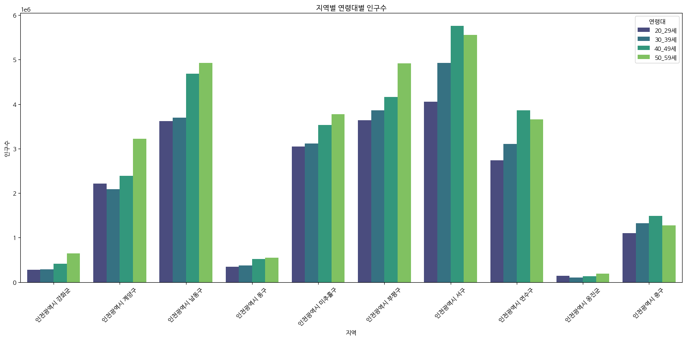
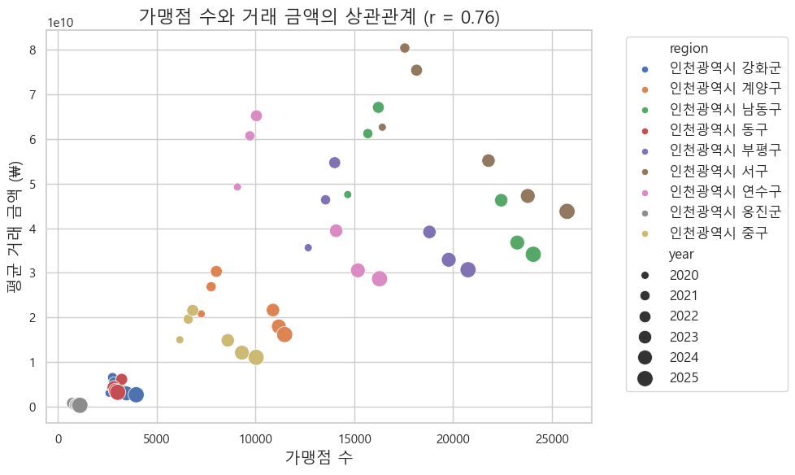
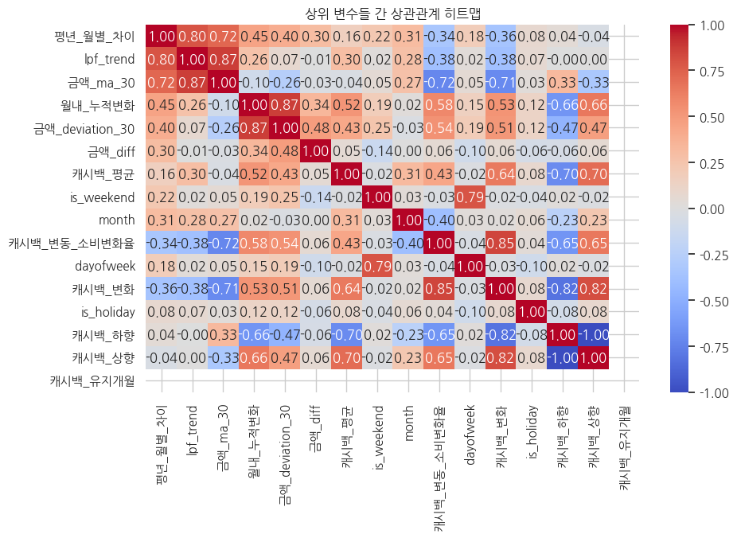
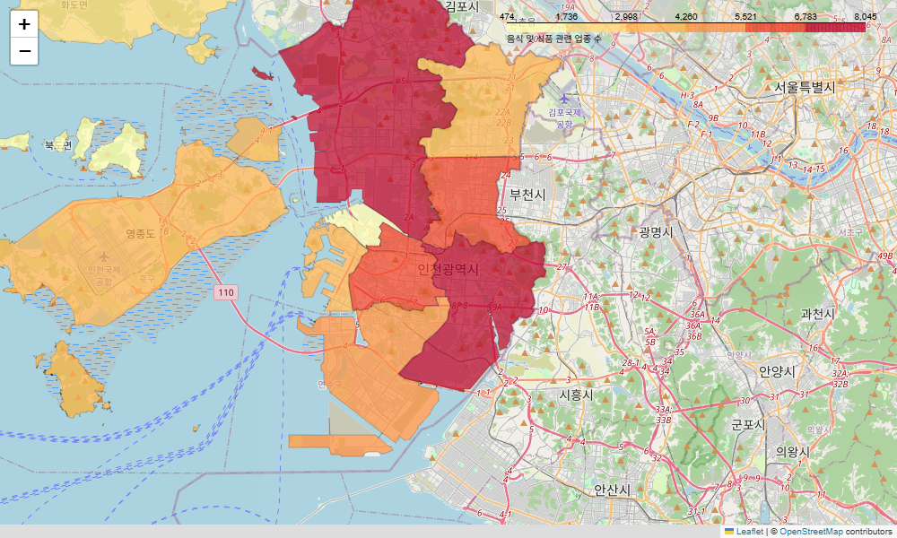
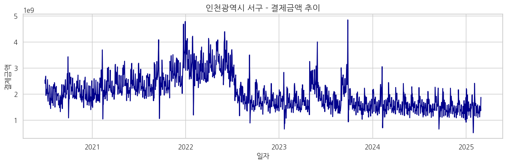
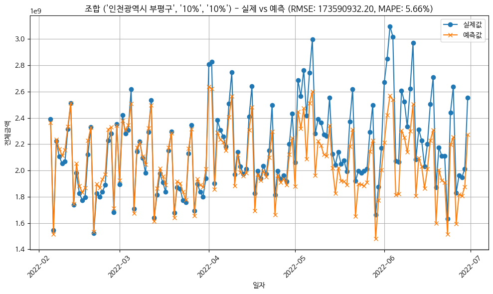

# 🎓 2025 Industry-Academic Capstone Design Competition

## 📌 Project: Incheon e-Eum Card Cashback Policy Responsiveness Analysis & Strategic Suggestions

This repository contains the project files for the **2025 Industry-Academic Capstone Design Competition**. The project delivers a data-driven strategy to optimize the cashback policy of "Incheon e-Eum" (Incheon's local currency), shifting from a passive, budget-draining approach to a proactive, ROI-driven simulation framework.

---

## 🔬 1. Problem Definition (문제 정의)

- **Background**: Incheon e-Eum was successful with a 10% cashback rate, but budget cuts forced a reduction to 5% in August 2022, leading to a **24.92% drop in monthly spending** and user churn.
- **Objective**: To transition from a fixed, experience-based operation to a **strategic, data-driven cashback policy** that maximizes consumer spending stimulus within a limited budget.
- **Vision**: "Maximizing policy efficiency through predictive simulation and ROI optimization."



## 📊 2. Data Acquisition & Preprocessing (데이터 수집 및 전처리)

- **Multi-Source Data Fusion**:
  - **Transaction Data**: Daily/Monthly spending by region and industry.
  - **Demographics**: Age distribution by administrative district.
  - **Economic Indicators**: Consumer Sentiment Index (CSI), CD interest rates.
  - **Policy Data**: Cashback rates, new sign-ups, and charge counts.



- **Refactored Modules**:
  - `src/data_preprocessing.py`: Automated cleaning and type conversion.
  - `src/feature_engineering.py`: Advanced feature extraction including Low-Pass Filter (LPF) for trend isolation.

## 📈 3. Statistical Analysis & Insights (통계 분석 및 인사이트)

- **Predictability Validation**: Calculated the **Hurst Exponent** for all regions, yielding high values of **0.79 to 0.86**. This proves that local spending patterns possess strong long-term directionality and are highly predictable.
- **Economic Correlation**: Discovered that spending is highly correlated with forward-looking indices like **Job Prospect CSI (0.235)** and **Interest Rate Prospect CSI (0.224)**, indicating a compensation-driven spending structure.



- **Geospatial Analysis**: Visualized the distribution of stores and spending across Incheon's districts (Gun/Gu) using Folium choropleth maps to identify regional disparities.



- **Trend Extraction**: Applied a Low-Pass Filter (LPF) to remove noise and isolate the core spending trajectory.




## 🤖 4. Modeling & Evaluation (모델링 및 평가)

- **Approach**: Implemented advanced Gradient Boosting models (LightGBM/CatBoost) trained on different policy periods (10% vs 5% cashback eras) to account for structural changes in consumer behavior.
- **Performance**: Achieved high precision with a **MAPE of 10% ~ 15%** across most regions, validating the model's reliability for policy simulation.



- **Refactored Module**: `src/model_training.py`

## 🔄 5. Policy Simulation & ROI Optimization (정책 시뮬레이션 및 ROI)

- **Simulation Design**: Assuming a budget constraint allowing only 2 months of cashback increase (to 10%) in 2024, we simulated all **66 possible combinations** ($C_{12, 2}$) to identify the highest Return on Investment (ROI).
- **Key Strategic Findings**:
  - **Timing Strategy**: Raising cashback *just before* the spending trajectory hits rock bottom yields the highest ROI.
  - **Holiday Strategy**: Intervening *just before* or *just after* major holidays (like Chuseok) is more effective than during the holiday month itself.
  - **Novelty Effect**: The spending response is maximized at the *first change* after a long period of rate maintenance.

## 🏁 6. Conclusion & Business Impact (결론 및 비즈니스 임팩트)

- **Regional Differentiation**: Recommended shifting low-response regions (e.g., Ganghwa, Ongjin) from direct cashback subsidies to indirect marketing support, while concentrating budget on high-response urban centers.
- **ROI Framework**: Established a standardized "Unit Month ROI" calculation system and benchmark to guide future policy interventions.

---

### 📂 Repository Structure

```text
├── notebooks/                   # Sequential Pipeline Notebooks
│   ├── 01_data_concatenation.ipynb
│   ├── 02_data_preprocessing.ipynb
│   ├── 03_feature_engineering.ipynb
│   ├── 04_eda.ipynb
│   ├── 05_prediction.ipynb
│   ├── 06_roi_analysis.ipynb
│   ├── 06_roi_analysis_v2.ipynb
│   ├── 07_clustering.ipynb
│   └── 08_visualization.ipynb
│
├── src/                         # Production-Ready Python Modules
│   ├── data_preprocessing.py    # Data cleaning and loading
│   ├── feature_engineering.py   # LPF, trend, and time-series features
│   └── model_training.py        # CatBoost training pipeline
│
├── reports/                     # Competition Reports
│   ├── 2025년 산학 캡스톤디자인 발표자료_산경만지회.pdf
│   └── 2025년 산학 캡스톤디자인 최종 결과보고서_산경만지회.pdf
│
├── run_pipeline.py             # Master pipeline runner
└── requirements.txt            # Project dependencies
```

## ⚙️ How to Run

1. Install dependencies:
   ```bash
   pip install -r requirements.txt
   ```
2. Run the full pipeline:
   ```bash
   python run_pipeline.py
   ```

## 👥 Contributors

- **Junhyung L.** (Project Lead / Data Scientist)

---
*Refactored and polished to meet professional software engineering standards for the [Data Analyst Portfolio](https://github.com/junhyung-L).*
