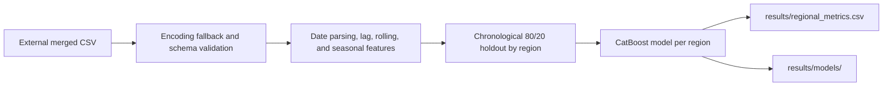

# Incheon e-Eum Cashback Policy Simulation

[한국어](README.ko.md)

> [Project details](PORTFOLIO.md)

This repository contains an exploratory regional-spending forecasting workflow
for Incheon e-Eum cashback-policy analysis. It includes the original notebooks
and a maintained command-line path for chronological regional model holdouts.

## Scope and result boundary

- **VERIFIED:** The maintained code loads a merged CSV, creates regional time
  features, and fits CatBoost holdout models by region.
- **USER_INPUT_REQUIRED:** The prior project narrative reports a Gold Prize,
  a 24.92% spending decline, 10–15% MAPE, and 66 policy scenarios. The raw
  source data, results, and award/score records are not retained here, so do
  not use those figures as independently verified portfolio claims.
- **NOT IMPLEMENTED:** The CLI forecasts regional spending; it does not prove
  a causal effect of cashback-policy changes or execute an ROI optimizer.

## Implemented workflow



The source notebooks retain additional preprocessing, LPF, EDA, policy,
clustering, and visualization experiments. The command-line path implements a
portable baseline rather than reproducing every notebook experiment.

## Retained visual evidence


*Figure 1. Retained project visual showing the reported spending, budget, and
new-sign-up trend. The annotated 24.92% change is a descriptive project result,
not a causal estimate from the maintained CLI.*


*Figure 2. Correlation heatmap retained from the exploratory workflow. It is
useful for feature inspection but does not establish a policy effect.*


*Figure 3. Retained actual-versus-predicted chart for one displayed
configuration; its annotation reports RMSE 173,590,932.20 and MAPE 5.66%.
This was not rerun from the current CLI and should not be represented as an
all-region performance result.*

## Run

Install dependencies:

```powershell
pip install -r requirements.txt
```

Run the workflow with the original merged CSV and its actual column names:

```powershell
python run_pipeline.py `
  --input-csv data\merged.csv `
  --region-col "<region column>" `
  --date-col "<date column>" `
  --target-col "<spending target column>"
```

The command writes generated features, per-region metrics, and fitted model
files under `results/`. Raw data is not included in this repository.

## Repository structure

```text
src/config.py             # Paths and modelling defaults
src/data_preprocessing.py # Original cleaning helper
src/feature_engineering.py# Original notebook-derived features
src/model_training.py     # Chronological per-region CatBoost training
run_pipeline.py           # Maintained CLI entry point
notebooks/                # Original analysis and simulation notebooks
```

## Limitations and next steps

- Add a permitted data schema or synthetic fixture and dependency versions.
- Retain regional backtest metrics and a naive baseline.
- Separate forecasting from causal policy-effect estimation before making ROI
  or intervention claims.
